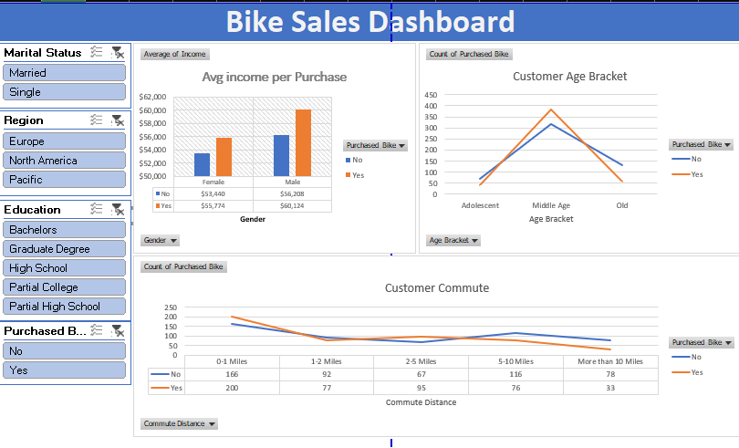

#🚴‍♂️ Bike Sales Dashboard (Excel Project)

##  Overview
This project presents an interactive **Bike Sales Dashboard** created in **Microsoft Excel**.  
It explores how customer demographics, income, and commute distance influence bike purchasing behavior.  
The goal is to uncover trends and insights through clean visualization and organized data analysis.

---

##  Objectives
- Analyze customer data to understand bike purchase patterns.  
- Create an easy-to-use dashboard for quick decision-making.  
- Showcase data visualization and Excel dashboard design skills.

---

##  Dashboard Highlights
- **Filters:** Marital Status, Education, and Region.  
- **Visuals:**
  - Income vs. Bike Purchase  
  - Age Bracket Breakdown  
  - Commute Distance Distribution  
  - Regional Purchase Comparison  
- **Design:** Simple, professional, and easy to interpret.

---

## Key Insights
- Middle-aged customers tend to purchase more bikes.  
- Higher income groups show greater interest in buying bikes.  
- Customers with short commutes are more likely to own bikes.  
- Purchases vary slightly by region.

---

## Tools & Skills Used
- **Microsoft Excel**
  - Pivot Tables  
  - Pivot Charts  
  - Slicers & Filters  
  - Data Cleaning & Formatting  
- **Analytical Thinking**  
- **Data Visualization**

---

## Future Enhancements
- Integrate Power Query for data updates.  
- Build an advanced version in Power BI.  
- Add time-based analysis for deeper insights.

---

## Author
**Hassan**  
Virtual Assistant & Data Analyst  
 B.Sc. Physics – University of Ilorin  
 [hassanhamzat1@gmail.com](mailto:hassanhamzat1@gmail.com)  
 [LinkedIn Profile](https://www.linkedin.com/in/hassan-hamzat-459b7320b/)

##  Dashboard Preview

📁 bike-sales-dashboard/
│
├── Bike_Sales_Dashboard.xlsx     # Excel dashboard file
├── dashboard.png                 # Screenshot of the dashboard
└── README.md                     # Project documentation

